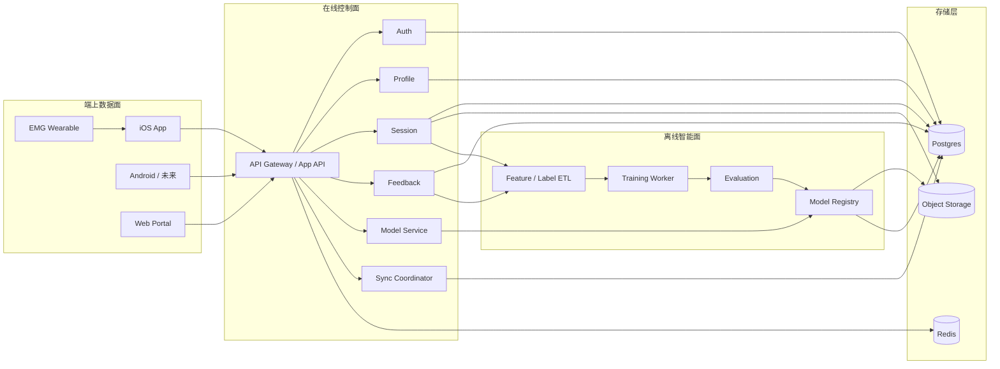
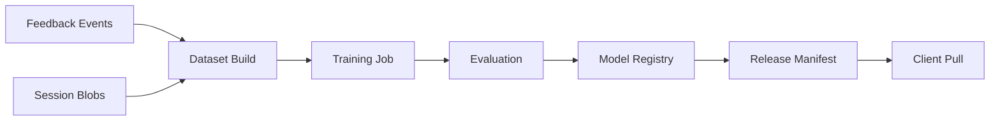

# FluxChi 产品化目标架构 V1

> 目的：定义 FluxChi 从“单机网关 / 研究原型”演进到“多人真实使用产品”的目标架构。  
> 适用对象：产品 owner、后端、iOS、算法、运维。  
> 约束：本文描述的是 **目标状态与演进路径**，不是当前代码的逐行说明。当前运行时结构仍以 [ARCHITECTURE.md](./ARCHITECTURE.md) 为准。

---

## 1. 要解决的问题

FluxChi 当前已经验证了三件事：

1. 端上可以实时采集和推理
2. Python 网关可以做会话归档、标注和轻量模型装载
3. 个性化画像可以做本地学习，并与服务端同步

但这仍是 **单用户 / 单机 / 弱约束** 形态。要面向真实产品，系统必须回答下面几个问题：

1. 多用户怎么隔离？
2. 多设备怎么同步？
3. 数据怎么长期存、怎么训、怎么发模型？
4. 如何在不牺牲端上实时性的前提下，把云端变成可靠的控制面？

---

## 2. 核心原则

### 2.1 端上实时，云端增强

- 实时采集、实时推理、实时告警必须在端上完成
- 云端只负责同步、存储、训练、模型分发、运营控制
- 任何云端故障都不应阻断端上基本能力

### 2.2 先做模块化单体，再做服务拆分

- 早期优先做 **Modular Monolith**
- 先把领域边界、数据库 schema、事件契约做清楚
- 只有在吞吐、团队协作或部署边界需要时再拆服务

### 2.3 小对象和大对象分开

- 小对象：用户、设备、画像、反馈事件、会话元数据，进关系型数据库
- 大对象：会话归档包、训练样本导出、模型文件、评估报告，进对象存储

### 2.4 追加写优先，覆盖写谨慎

- 反馈事件、训练样本、模型发布应优先设计为追加写
- 只有 `profile state` 一类“当前态”资源允许覆盖写
- 覆盖写必须带版本或时间戳

### 2.5 幂等是必选项

- session 上传
- feedback 提交
- profile 写入
- model manifest 拉取

这些接口必须从第一版开始就支持幂等，否则后续补救成本很高。

---

## 3. 当前状态与目标状态

| 维度 | 当前实现 | 目标状态 |
|------|----------|----------|
| 用户模型 | 单机、本地偏移 + 轻量服务端 profile JSON | 多租户 profile state + device calibration + feedback events |
| 存储 | 本地文件 / SQLite / JSON | Postgres + Object Storage + Redis |
| 服务边界 | `web/app.py` 单入口 | 模块化单体，按领域拆包 |
| 训练 | 手动脚本触发 | 异步训练任务 + 模型注册 + 灰度发布 |
| 同步 | 手动 push/pull | 明确版本策略 + 后续自动同步 |
| 安全 | 个人环境默认信任 | 用户认证、设备绑定、限流、审计 |
| 运行规模 | 单用户 / 小规模 | 多用户、跨设备、持续迭代 |

---

## 4. 目标系统全景



---

## 5. 三个平面

### 5.1 端上数据面

职责：

- 采集 EMG / 视觉 / 用户输入
- 本地实时推理
- 本地会话缓存
- 本地 profile 应用
- 弱网 / 断网场景下继续工作

特点：

- 强实时
- 可离线
- 对用户体验负责

不做的事：

- 云端依赖的训练
- 跨用户聚合分析
- 大规模检索

### 5.2 在线控制面

职责：

- 用户认证与设备绑定
- profile 当前态同步
- 会话上传和检索
- feedback 事件写入
- model manifest 下发
- feature flag / rollout

特点：

- 强一致性优先于高吞吐
- 面向产品、账号、运营、客户端契约

### 5.3 离线智能面

职责：

- 训练样本构建
- 标注与特征聚合
- 训练和评估
- 模型注册与回滚

特点：

- 异步
- 可重跑
- 面向数据资产和实验效率

---

## 6. 核心领域拆分

### 6.1 Auth

实体：

- `user`
- `refresh_token`
- `device_binding`

职责：

- 注册、登录、token 刷新
- 设备绑定与撤销
- 访问控制

### 6.2 Profile

实体：

- `profile_state`
- `device_calibration`

职责：

- 存用户当前个性化状态
- 存各设备校准状态
- 提供版本化读写

### 6.3 Feedback

实体：

- `feedback_event`

职责：

- 追加写用户主观反馈
- 训练标签入口
- 幂等去重

### 6.4 Session

实体：

- `session`
- `session_blob`

职责：

- 接收端上导出包
- 存会话元信息
- 存对象存储 blob 地址

### 6.5 Model

实体：

- `model_registry`
- `model_release`
- `model_manifest`

职责：

- 记录模型版本
- 记录适配平台
- 灰度发布和回滚

### 6.6 Sync

实体：

- `sync_cursor`
- `device_sync_state`

职责：

- 管理客户端同步进度
- 后续自动同步时作为统一出口

---

## 7. 规范化数据模型

### 7.1 `profile_state`

这是“当前态”，不是事件流。

建议字段：

```json
{
  "profile_id": "pf_...",
  "user_id": "usr_...",
  "version": 12,
  "updated_at": "2026-03-24T12:00:00Z",
  "calibration_offset": 6.5,
  "estimated_accuracy": 82.0,
  "training_count": 143,
  "active_model_release_id": "mr_...",
  "summary": {
    "retained_feedback_count": 500,
    "avg_absolute_error": 11.2
  }
}
```

### 7.2 `device_calibration`

每设备一条，`device_id` 是主键之一。

```json
{
  "device_id": "dev_...",
  "user_id": "usr_...",
  "platform": "ios",
  "device_name": "iPhone 17 Pro",
  "sensor_profile": {
    "source": "ble",
    "channel_count": 8
  },
  "calibration_offset": 5.0,
  "updated_at": "2026-03-24T12:00:00Z"
}
```

### 7.3 `feedback_event`

必须是追加写，不应该持续塞回 `profile blob`。

```json
{
  "feedback_event_id": "fbk_...",
  "user_id": "usr_...",
  "device_id": "dev_...",
  "session_id": "ses_...",
  "idempotency_key": "ios:session_uuid:feedback_v1",
  "predicted_stamina": 61,
  "actual_stamina": 35,
  "label": "fatigued",
  "kss": 8,
  "created_at": "2026-03-24T12:00:00Z"
}
```

### 7.4 `session`

元数据与 blob 分离。

```json
{
  "session_id": "ses_...",
  "user_id": "usr_...",
  "device_id": "dev_...",
  "started_at": "2026-03-24T10:00:00Z",
  "ended_at": "2026-03-24T11:10:00Z",
  "source": "ios_ble",
  "duration_sec": 4200,
  "snapshot_count": 8400,
  "blob_uri": "s3://bucket/sessions/2026/03/24/....json",
  "status": "ready"
}
```

---

## 8. API 设计原则

### 8.1 必须稳定的资源 ID

- `user_id`
- `profile_id`
- `device_id`
- `session_id`
- `feedback_event_id`
- `model_release_id`

禁止依赖：

- 本地 hash
- 临时文件名
- `persistentModelID.hashValue`

### 8.2 写接口必须幂等

建议：

- `POST /v1/feedback-events` 支持 `Idempotency-Key`
- `POST /v1/sessions` 支持客户端提供 `session_id`
- `PUT /v1/profile` 支持 `version` 或 `updated_at`

### 8.3 版本控制策略

短期：

- `updated_at` + last-write-wins

中期：

- `version` 递增
- 客户端提交 `base_version`
- 服务端返回 `409 conflict`

长期：

- `cursor` 驱动增量同步

---

## 9. 推荐 API 边界

### 9.1 Auth

- `POST /v1/auth/sign-up`
- `POST /v1/auth/sign-in`
- `POST /v1/auth/refresh`
- `POST /v1/auth/sign-out`

### 9.2 Profile

- `GET /v1/profile`
- `PUT /v1/profile`
- `GET /v1/devices`
- `PUT /v1/devices/{device_id}/calibration`

### 9.3 Feedback

- `POST /v1/feedback-events`
- `GET /v1/feedback-events`

### 9.4 Session

- `POST /v1/sessions`
- `GET /v1/sessions`
- `GET /v1/sessions/{session_id}`
- `GET /v1/sessions/{session_id}/download`

### 9.5 Model

- `GET /v1/models/manifest`
- `GET /v1/models/releases/{release_id}`

### 9.6 Sync

- `GET /v1/sync/bootstrap`
- `GET /v1/sync/changes?cursor=...`

---

## 10. 存储选型

### 10.1 Postgres

用于：

- 用户和认证主体
- 画像当前态
- 设备校准
- 反馈事件
- 会话元数据
- 模型注册表
- 同步游标

原因：

- 事务与一致性强
- 查询能力足够
- 适合中后台与产品 API

### 10.2 Object Storage

用于：

- 会话导出包
- 训练样本快照
- ONNX / CoreML / manifest 文件
- 评估报告

原因：

- 成本低
- 适合大对象
- 易做版本化

### 10.3 Redis

用于：

- 限流
- 幂等 key
- 热门 manifest 缓存
- 后台任务短期状态

---

## 11. 模型生命周期



规则：

1. 在线服务不做同步训练
2. 训练结果必须先评估再注册
3. 客户端永远拉 manifest，不直接猜模型路径
4. 模型发布支持回滚

推荐区分三类模型：

1. `global_base_model`
2. `segment_model`，例如按设备类型或人群分层
3. `personalization_parameters`，如端上 offset / threshold / calibration

产品第一阶段不要做“每用户一个完整专属模型”，先做：

- 全局基础模型统一发布
- 用户端上个性化参数单独同步

---

## 12. 安全与合规

最低要求：

1. 全链路 HTTPS
2. JWT 或等价 token 方案
3. refresh token 可撤销
4. 设备绑定和设备撤销
5. 限流
6. 审计日志
7. PII 与传感器数据分层管理

需要尽早决定的隐私策略：

- 是否长期存 raw session export
- 是否允许用户删除历史数据
- 训练集是否默认使用匿名化样本
- 是否允许用户退出数据飞轮

---

## 13. 可观测性与运维

必须从 V1 就做：

1. 结构化日志
2. request id / trace id
3. API 延迟和错误率指标
4. 后台任务成功率
5. 模型命中版本统计
6. 同步成功率与冲突率

推荐：

- OpenTelemetry
- Sentry
- Prometheus + Grafana

---

## 14. 演进路线

### Phase 0: 研究原型

现状：

- 本地 Python 网关
- 本地 JSON / SQLite
- 手动训练
- 端上实时推理

### Phase 1: 可演进单体

目标：

- 保留单进程部署
- 按领域拆模块
- 接 Postgres
- 接对象存储
- 完成 Auth / Profile / Session / Feedback / Model 的统一 API

这是第一个真正可上线的形态。

### Phase 2: 生产基础设施

目标：

- 鉴权
- 限流
- 监控报警
- 后台任务系统
- model registry
- 灰度发布

### Phase 3: 数据平台化

目标：

- 训练任务调度
- 数据集版本化
- 自动评估
- 自动生成 manifest

### Phase 4: 服务拆分

只在出现明确瓶颈时拆：

1. 先拆 `training-worker`
2. 再拆 `session-service`
3. 最后视需要拆 `profile` / `auth`

---

## 15. 代码组织建议

当进入 Phase 1，建议从当前 `web/app.py` 演进为：

```text
server/
  app/
    api/
      auth.py
      profile.py
      session.py
      feedback.py
      model.py
    domain/
      auth/
      profile/
      session/
      feedback/
      model/
    repositories/
      postgres/
      object_store/
      cache/
    services/
      auth_service.py
      profile_service.py
      session_service.py
      feedback_service.py
      model_service.py
    workers/
      training_worker.py
      dataset_worker.py
    main.py
```

这一步的目的不是“看起来高级”，而是把：

- HTTP
- 业务逻辑
- 存储访问
- 异步任务

四层拆开。

---

## 16. 与当前仓库的关系

当前仓库里仍然保留：

- `web/app.py`，单体入口
- `src/session_store.py`，本地会话归档
- `src/flywheel/store.py`，本地飞轮存储
- `src/profile_store.py`，本地 profile JSON 存储

这些都属于 **Phase 0 / Phase 1 过渡实现**。它们仍然有价值，但不应被视为 100 万用户版本的最终后端形态。

---

## 17. 下一步

下一份配套文档是 [PLATFORM-CONTRACT-V1.md](./PLATFORM-CONTRACT-V1.md)，其中会把：

1. `auth/profile/session/feedback/model/sync` 的 API Contract 写清楚
2. Postgres 表结构、主外键、唯一约束、版本字段、索引策略写清楚

在这份合同没有定稿之前，不建议直接大规模重构后端代码。
