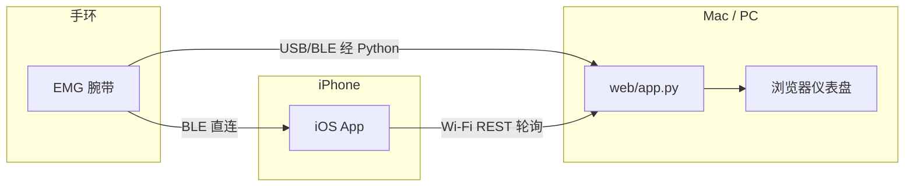

# FluxChi 系统架构（主线：Web 后端 + iOS）

本文描述仓库内**三条可独立运行**的软件路径，以及它们之间的**可选耦合**。阅读对象：贡献者、论文复现、二次开发。

若你关心的是 **面向真实产品、多设备、多用户与长期演进** 的目标架构，请同时阅读 [ARCHITECTURE-PRODUCTION-V1.md](./ARCHITECTURE-PRODUCTION-V1.md)。本文更偏向 **当前仓库的运行时结构**。

---

## 1. 三条运行时（不要混为一个「全栈」）

| 运行时 | 入口 | 职责 |
|--------|------|------|
| **Web 后端 + 仪表盘** | `python web/app.py ...` | FastAPI：REST + SSE + WebSocket；浏览器静态仪表盘；从本机 **串口 / bleak(BLE)** 读 EMG，跑 ONNX + `StaminaEngine`。 |
| **桌面手势训练** | `python app.py ...`（仓库根目录） | 独立 **matplotlib UI**，串口采集与手势录制/训练。**不提供** `web/app.py` 的 HTTP 服务。 |
| **iOS 应用** | Xcode 打开 `ios/FluxChi.xcodeproj` | SwiftUI + SwiftData；两种数据源**二选一或切换**（见下）。 |

---

## 2. iOS 与 Web：并行，而非从属

- **BLE 直连**：iOS 通过 `BLEManager` 读手环，`OnDeviceStaminaEngine` + CoreML 等在**端上**推算；**不要求** Mac 上跑 `web/app.py`。  
- **Wi‑Fi 模式**：iOS `FluxService` 轮询 `http://<host>:8000/api/v1/...`，与浏览器共用**同一 Python 引擎**。  
- **自动切换**：App 层在 BLE 连接时通常停止 Wi‑Fi 轮询（见 `FluxChiApp`）。

---

## 3. Python 后端内部（`web/app.py` + `src/`）

- **数据入口**：`SerialEMGStream` / `BleEMGStream`（`src/stream.py`）等。  
- **特征与分类**：`src/features.py`、`src/inference.py`（ONNX）。  
- **续航核心**：`src/energy.py`（`StaminaEngine`）。  
- **建议层**：`src/decision.py`。  
- **对外协议**：REST `/api/v1/*`、SSE `/api/v1/stream`、`/ws`（仪表盘用）。详见 [API-OVERVIEW.md](./API-OVERVIEW.md) 与运行中的 **Swagger UI**（`/docs`）。

---

## 4. iOS 应用内部（概要）

- **网络**：`FluxService`（URLSession 轮询）。  
- **蓝牙**：`BLEManager`（CoreBluetooth）。  
- **会话与持久化**：SwiftData（`Session` / `Segment` / `FluxSnapshot`）。  
- **扩展**：`FluxChiLive`（Widget + Live Activity），与主 App 经 App Group 共享摘要。  

细节见 [`../ios/README.md`](../ios/README.md)。

---

## 5. 与「桌面 `app.py`」的关系

根目录 `app.py` 与 `web/app.py` **共享部分 `src/`**（如流、特征），但**进程与 UI 完全独立**。论文或 README 中引用「FluxChi」时需指明是 **Web 管线**、**桌面手势工具** 还是 **iOS**。

---

## 6. 文档索引

| 文档 | 内容 |
|------|------|
| [DEVELOPMENT.md](./DEVELOPMENT.md) | 环境、最短跑通路径、常见故障 |
| [API.md](./API.md) | REST/SSE 详解与 Swift 示例（人工维护，与 `/docs` 对照） |
| [API-OVERVIEW.md](./API-OVERVIEW.md) | 端点索引、iOS 最小子集、废弃路径说明 |
| [API-CHANGELOG.md](./API-CHANGELOG.md) | 对外 JSON 契约变更记录 |

---

*最后更新：与仓库 `main` 结构同步维护；版本号以 `ios/FluxChi/Models/FluxMeta.swift` 与 Xcode `MARKETING_VERSION` 为准。*
