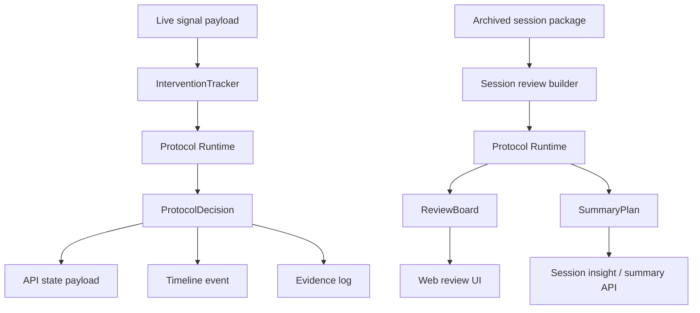

# FluxChi Protocol-Driven Intervention Loop Design

Date: 2026-04-02
Status: Draft for review

## Goal

Create a protocol-driven middle layer for FluxChi that:

- keeps the current quiet, low-friction product direction
- turns intervention, review, summary, and hypothesis generation into a single readable system
- borrows the best part of `NeuroSkill` without adopting its BCI-heavy hardware assumptions
- makes future experimentation and iteration easier than hard-coding all rules in Python and front-end JS

The target product loop is:

`state evidence -> protocol decision -> surfaced or silent action -> review -> summary -> next hypothesis`

## Why This Exists

FluxChi already has useful building blocks:

- deterministic live intervention stages in [src/intervention_policy.py](../../../src/intervention_policy.py)
- archived session review in [src/session_review.py](../../../src/session_review.py)
- short session insight text in [src/session_insight.py](../../../src/session_insight.py)
- a quiet cockpit UI in [web/static/dashboard.js](../../../web/static/dashboard.js)

But the current logic is still scattered:

- intervention stages are defined in Python
- protocol copy and ordering are duplicated in JS
- post-session summary is rule-based but not protocol-aware
- there is no first-class representation of “what rule fired, why, and what should happen next”

That makes iteration harder than it should be.

The design goal is to add a human-readable protocol layer that becomes the product’s source of truth for:

- what counts as a quiet intervention
- when a visible nudge is allowed
- how review cards are derived from evidence
- how a summary should convert evidence into an actionable next experiment

## Product Interpretation of NeuroSkill

What FluxChi should learn from `NeuroSkill`:

- a readable protocol layer is valuable
- state evidence should map to explicit action templates
- the system should feel like a quiet assistant, not only a dashboard

What FluxChi should not copy yet:

- BCI as the primary sensing path
- a heavy offline agent runtime
- broad “human state of mind” ambitions before the focused loop is stable

So the translation is:

`NeuroSkill protocol layer -> FluxChi quiet-loop protocol`

## Scope

This design covers:

- protocol file structure for intervention, review, summary, and hypothesis steps
- a protocol runtime that interprets those files against current state and session review objects
- back-end data contracts for protocol-driven output
- minimal Web hooks so the existing cockpit visibly reflects protocol decisions
- evidence logging requirements so each surfaced action can later be evaluated

This design does not cover:

- training a new fatigue model
- a visual protocol editor
- free-form LLM agents deciding interventions in production
- a full multi-user experiment platform
- replacing the current web app architecture

## Design Principles

1. `Silent by default` remains the top product rule.
2. Protocol must be readable by a human before it is executable by code.
3. Deterministic rules come first; learned optimization can be layered later.
4. Intervention, review, and summary must use one shared vocabulary.
5. Every visible action should leave evidence for later evaluation.
6. The UI should render protocol state, not invent business logic on its own.

## Desired Product Outcome

After this work, FluxChi should feel less like:

- a dashboard with a few heuristics

and more like:

- a quiet agent with explicit rules for when to stay silent
- a review surface that explains what happened in protocol terms
- a summary surface that proposes one concrete next experiment

## Current Constraints

The existing system suggests a narrow, practical path:

- keep FastAPI plus static HTML/CSS/JS
- keep deterministic signal and session processing
- do not break existing `/api/v1/state`, `/api/v1/timeline`, and session review flows
- preserve the existing stage model:
  - `steady`
  - `silent_log`
  - `light_nudge`
  - `escalation`
  - `recovered`

The new layer should sit above current signal logic, not replace it.

## Proposed Architecture

### 1. Protocol Pack

Introduce one versioned protocol pack as a repo file, for example:

- `config/fluxchi/protocols/quiet_loop_v1.yaml`

This file becomes the source of truth for:

- stage ordering
- trigger thresholds and evidence requirements
- surface behavior
- review card generation rules
- summary block templates
- hypothesis templates
- effect-evaluation windows

The first version should be fully deterministic and checked into git.

### 2. Protocol Runtime

Introduce a thin runtime layer that:

- loads the protocol pack
- validates it into typed Python structures
- evaluates protocol rules against:
  - current live state payload
  - intervention tracker state
  - archived session review
- returns structured, UI-ready protocol output

This runtime is not an LLM agent.

It is a deterministic interpreter for a human-readable rule pack.

### 3. Shared Domain Objects

The protocol runtime should produce three shared objects:

- `ProtocolDecision`
  - what stage the system is in now
  - which rule fired
  - whether the action should surface
  - what evidence justified it
- `ReviewBoard`
  - protocol-aware cards and moments derived from session review
- `SummaryPlan`
  - observation
  - interpretation
  - next experiment
  - confidence

These objects should be used by both backend responses and front-end rendering.

### 4. Evidence Logging

Each relevant decision point should produce a compact evidence record with:

- `protocol_id`
- `rule_id`
- `session_id`
- `timestamp`
- `stage`
- `surface_type`
- `decision_context`
- `evidence_refs`
- `pre_window`
- `post_window`
- `proximal_outcome`

This is the minimum needed for a future data flywheel.

## Protocol Structure

The initial protocol pack should have four sections.

### A. Intervention Protocol

Defines:

- available stages
- entry conditions
- cooldown behavior
- whether the stage is silent or visible
- expected UI tone
- next state transition hints

Example shape:

```yaml
protocol_id: quiet_loop_v1

intervention:
  stages:
    - id: silent_log
      enters_when:
        any:
          - urgency_gte: 0.35
          - stamina_lte: 55
      surface: silent
      cooldown_sec: 240
      next_step: keep_logging

    - id: light_nudge
      enters_when:
        any:
          - sustained_decline_sec_gte: 300
          - urgency_gte: 0.55
      surface: visible
      cooldown_sec: 240
      next_step: nudge_once

    - id: escalation
      enters_when:
        any:
          - alert_in: [perclos_severe, microsleep_detected, nod_detected]
          - urgency_gte: 0.85
          - stamina_lte: 25
      surface: visible
      cooldown_sec: 0
      next_step: pause_and_review
```

This is deliberately close to the current logic so v1 is low-risk.

### B. Review Protocol

Defines how archived review data turns into cards.

Initial card types should include:

- `largest_drop`
- `failed_recovery`
- `high_tension_segment`
- `stable_block`
- `review_candidate_intervention`

Each card should define:

- when it appears
- title
- explanation
- linked evidence fields
- whether it suggests a follow-up experiment

### C. Summary Protocol

Defines a structured post-session summary format.

The summary should not be one long paragraph.

It should emit stable blocks:

- `Observation`
- `Likely Interpretation`
- `Next Experiment`
- `Confidence`

This allows:

- deterministic output now
- optional LLM rewriting later without changing the underlying schema

### D. Hypothesis Protocol

Defines how the system proposes a next test.

The first version should stay simple:

- one session should produce at most one primary hypothesis
- the hypothesis should always be tied to evidence seen in the review
- the hypothesis should suggest a measurable next action

Example output shape:

```json
{
  "hypothesis": "When tension stays high for more than 2 minutes, stamina drop becomes more likely.",
  "next_experiment": "In the next 2 sessions, trigger a 30-second shoulder reset when tension stays above threshold.",
  "confidence": "medium",
  "based_on": ["high_tension_segment", "largest_drop"]
}
```

## Runtime Flow



Practical interpretation:

- the current trackers still compute base signals
- the protocol runtime interprets them
- the UI renders the interpreted result
- evidence is logged whenever the protocol makes a meaningful decision

## Back-End Surface Changes

The current API should evolve, not break.

### `/api/v1/state`

Continue returning live `intervention`, but make it protocol-aware by adding:

- `protocol.id`
- `protocol.rule_id`
- `protocol.surface`
- `protocol.reason_copy`

### `/api/v1/timeline`

Each event should carry:

- `protocol_id`
- `rule_id`
- `stage`
- `surface_type`
- `evidence`

### `/api/v1/sessions/{id}/review`

Expand the review response to include:

- `review_board`
- `summary_plan`
- `hypothesis`

The existing session review fields can remain for backward compatibility.

## Front-End Impact

The current cockpit UI does not need a redesign-first rewrite.

It needs protocol hooks.

### Live Cockpit

Make these protocol-driven:

- intervention rail ordering and descriptions
- stage reason copy
- visible versus silent treatment labels
- current next-step hint

### Review Board

Add protocol-aware sections:

- `What happened`
- `Why this likely mattered`
- `What to test next`

### Summary Panel

Show the structured summary blocks instead of only narrative prose:

- observation
- interpretation
- next experiment
- confidence

This is the first step toward the “mind to graph” reading experience the product wants.

## Evidence Flywheel Requirements

This design only needs the minimum viable flywheel, not a full experimentation system.

For each visible intervention and each completed session, capture enough data to answer:

- what rule fired
- what evidence supported it
- whether the user was interrupted visibly or silently
- whether state recovered afterward
- what next hypothesis the system proposed

That makes later work possible:

- micro-randomization
- personalized rule tuning
- protocol A/B comparisons
- “which nudge works for this person” analysis

## File and Responsibility Boundaries

This design implies a future structure like:

- `config/fluxchi/protocols/quiet_loop_v1.yaml`
  - first versioned protocol pack
- `src/protocol_models.py`
  - typed protocol data structures
- `src/protocol_loader.py`
  - parse and validate protocol packs
- `src/protocol_runtime.py`
  - evaluate protocol against live and archived evidence
- `src/protocol_summary.py`
  - build structured summary and hypothesis output
- `tests/test_protocol_loader.py`
  - protocol parsing and validation tests
- `tests/test_protocol_runtime.py`
  - stage transitions and rule-resolution tests
- `tests/test_protocol_summary.py`
  - summary and hypothesis generation tests

Existing files likely to integrate with this:

- [src/intervention_policy.py](../../../src/intervention_policy.py)
- [src/session_review.py](../../../src/session_review.py)
- [src/session_insight.py](../../../src/session_insight.py)
- [web/app.py](../../../web/app.py)
- [web/static/dashboard.js](../../../web/static/dashboard.js)

## Rollout Strategy

This should be implemented in three narrow passes.

### Pass 1. Protocol extraction

- move stage metadata and copy into a protocol pack
- load it safely
- expose protocol identifiers in live API output

### Pass 2. Review and summary orchestration

- drive review cards and structured summary from protocol rules
- add one hypothesis block per session

### Pass 3. Evidence hooks

- log protocol decisions with enough context for pre/post evaluation
- expose these records in a simple inspection surface later

## Risks

### Risk 1. Overbuilding a fake agent

Mitigation:

- keep v1 deterministic
- keep the protocol pack small
- avoid free-form natural-language decision making

### Risk 2. Duplicating logic instead of centralizing it

Mitigation:

- front-end only renders protocol output
- back-end keeps protocol as source of truth

### Risk 3. Premature experimentation complexity

Mitigation:

- only log minimal effect data in v1
- delay randomization until the protocol loop is stable

## Success Criteria

This design is successful when:

1. intervention stages are described in one versioned protocol pack
2. live API responses identify which protocol rule produced the current state
3. session review output contains structured `summary` and `next experiment` blocks
4. the Web UI renders protocol-aware review and summary content without embedding its own rule logic
5. every visible intervention yields enough evidence for later effect analysis

## Open Questions for Later

These are intentionally postponed:

- should users be able to author custom protocol rules
- when should protocol rules become personalized
- whether summary text should remain deterministic or be LLM-rewritten
- whether a lightweight `skill` file should be exposed to non-engineers later

## Recommendation

Build this as the next FluxChi sub-project.

It is the cleanest way to:

- adopt the most useful idea from `NeuroSkill`
- preserve your quiet-product philosophy
- reduce rule sprawl across Python and JS
- prepare the system for a real evidence flywheel
