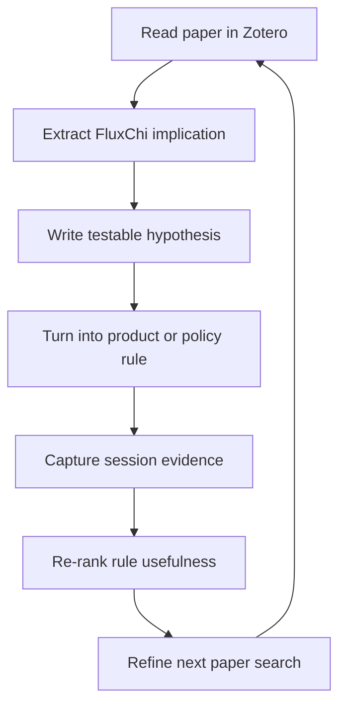
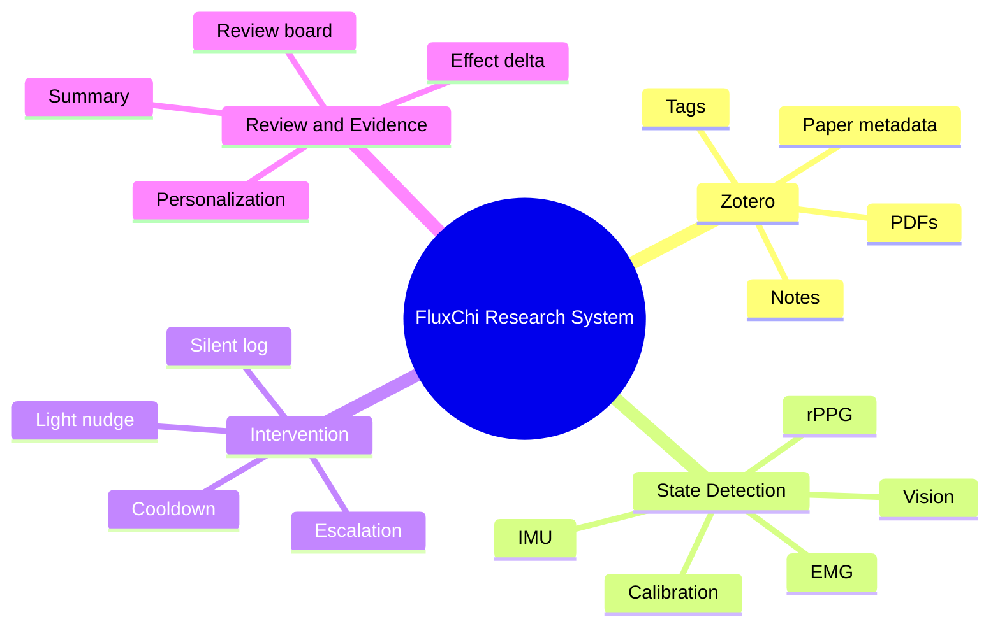

# FluxChi Research Workflow Design

Date: 2026-04-02
Status: Draft for review

## Goal

Create a lightweight research workflow for FluxChi that:

- uses Zotero as the paper system of record
- keeps repo-side research docs minimal and organized
- turns papers into concrete product implications, testable hypotheses, and evidence loops
- supports iterative product decisions for:
  - multimodal state detection
  - intervention strategy
  - review and evidence design

## Why This Exists

FluxChi is no longer just a signal dashboard. The current direction is:

- silent, low-friction sensing during work
- minimal interruption by default
- post-session review and summary
- long-term personalization and data flywheel

That requires a research workflow that does more than collect papers. It must connect:

`paper -> implication -> hypothesis -> product rule -> evidence -> next paper`

## Scope

This design covers:

- Zotero library structure
- repo-side research entrypoints
- note template and tagging rules
- a lightweight evidence-oriented workflow
- first-pass literature intake order

This design does not cover:

- a Zotero plugin or skill implementation
- direct product code changes
- experiment execution details inside the app

## Design Principles

1. Keep the repo clean.
2. Put detailed paper notes in Zotero, not scattered markdown files.
3. Only record insights that can influence FluxChi decisions.
4. Prefer iterative evidence loops over static literature summaries.
5. Support future agent-style rules, but do not overbuild now.

## Proposed Structure

### Zotero

Zotero is the primary home for:

- paper metadata
- PDFs
- tags
- structured notes
- annotations

Library name:

- `FluxChi`

### Repo

Keep repo-side research docs thin and centralized under:

- `docs/research/fluxchi/README.md`
- `docs/research/fluxchi/zotero-schema.md`
- `docs/research/fluxchi/research-questions.md`

Purpose of each file:

- `README.md`
  - explains the purpose of the research area
  - states the current focus areas
  - tells contributors where detailed notes actually live
- `zotero-schema.md`
  - defines Collections, Tags, note template, naming rules
- `research-questions.md`
  - lists the current product and research questions FluxChi is trying to answer
  - does not store paper-level summaries

## Zotero Collections

Keep Collections intentionally small:

- `00 Inbox`
- `01 Multimodal State Detection`
- `02 Intervention Strategy`
- `03 Review & Evidence Design`
- `90 Maybe Later`

Collection intent:

- `00 Inbox`
  - newly added papers not yet processed
- `01 Multimodal State Detection`
  - papers that help decide which signals and combinations reliably map to user state
- `02 Intervention Strategy`
  - papers about interruption timing, nudges, escalation, fatigue-related action policy
- `03 Review & Evidence Design`
  - papers about post-session interpretation, explainability, natural experiments, and evidence capture
- `90 Maybe Later`
  - related but not currently driving product choices

## Zotero Tags

Use flat tags with prefixes for stable search.

### Signal tags

- `sig/emg`
- `sig/vision`
- `sig/imu`
- `sig/rppg`
- `sig/hrv`
- `sig/multimodal`

### State tags

- `state/fatigue`
- `state/focus`
- `state/stress`
- `state/recovery`
- `state/drowsiness`

### Product behavior tags

- `ux/silent-log`
- `ux/light-nudge`
- `ux/escalation`
- `ux/review`
- `ux/summary`

### Method tags

- `method/calibration`
- `method/personalization`
- `method/longitudinal`
- `method/ecological`
- `method/interruption`

### Processing tags

- `status/inbox`
- `status/read`
- `status/noted`
- `status/actionable`

Rules:

- each paper must belong to one primary Collection
- each paper should usually have 5 to 8 tags, not more
- only papers that directly influence a design or experiment decision should get `status/actionable`

## Zotero Note Template

Notes use English terms with Chinese explanation.

```md
## Research Question
这篇论文在解决什么问题？

## Signals / Modalities
用了哪些信号？
如 EMG / vision / IMU / rPPG / HRV / multimodal

## Setting / Population
实验对象是谁？场景是什么？
如 office work / driving / lab task / daily life

## Metrics
核心指标是什么？
如 fatigue, focus, workload, interruption cost, recovery

## Key Findings
最重要的 3-5 条发现是什么？

## Limitations
这篇论文哪里不够强？
样本量、生态效度、单模态、个体差异、实验设置等

## FluxChi Implication
对 FluxChi 有什么具体启发？
是影响 state detection、intervention strategy，还是 review design？

## Adopt / Reject / Unsure
我们是否采纳这篇论文的思路？为什么？

## Testable Hypothesis
这篇论文在 FluxChi 里可以变成什么可验证假设？
```

Template rules:

- `Key Findings` should stay under 5 bullets
- `FluxChi Implication` must be written in product language, not only academic summary
- `Testable Hypothesis` must be measurable with future FluxChi session data
- if a paper has no concrete product implication, it should not be marked `status/actionable`

## Research Flywheel

The workflow should support repeated iteration, not one-time reading.



Practical interpretation:

- read papers to extract rules, not to produce passive summaries
- convert selected findings into hypotheses
- ship rules into product decisions later
- collect evidence from real sessions
- use results to revise both literature priorities and product logic

## Mind Map



## Recommended Research Sequence

Primary order:

1. `01 Multimodal State Detection`
2. `02 Intervention Strategy`
3. `03 Review & Evidence Design`

Reasoning:

- intervention policy should not be built on unstable state detection
- review and evidence design become more useful after the first two are grounded

First-pass paper intake order:

1. multimodal fatigue or state detection papers using combinations close to FluxChi
   - EMG + IMU
   - vision + physiological signals
   - multimodal fatigue detection with personalization
2. interruption and notification timing papers
   - especially low-disruption or fatigue-aware intervention work
3. review and explainability papers
   - especially post-session reflection, behavior review, and natural experiment framing

## Minimum Weekly Usage Flow

Use the system lightly at first.

Per paper:

1. add to Zotero `00 Inbox`
2. assign primary Collection
3. apply tags
4. fill the structured note
5. decide whether it is `status/actionable`

Per week:

1. process 3 to 5 papers
2. extract 1 to 3 serious product implications
3. promote at most 1 new hypothesis into the current design backlog

This avoids a large paper archive with no product consequences.

## Success Criteria

The workflow is working if, after the first 2 to 3 weeks:

- the Zotero library has clean Collections and tags
- at least 10 papers are processed with structured notes
- at least 5 papers are marked `status/actionable`
- at least 3 FluxChi-specific hypotheses have been written
- current design discussions can cite concrete paper implications quickly

## Risks and Guardrails

### Risk: over-collecting papers

Guardrail:

- only process papers tied to a current FluxChi question

### Risk: academic notes that never affect the product

Guardrail:

- require `FluxChi Implication` and `Testable Hypothesis` for processed papers

### Risk: repo clutter

Guardrail:

- keep detailed notes in Zotero
- keep repo-side research docs thin

### Risk: premature rule complexity

Guardrail:

- do not implement agent-style research automation yet
- stabilize the workflow first

## Open Follow-On Work

After this workflow is in place, the next design should define:

- first-batch paper list
- FluxChi intervention policy v1
- evidence capture schema for session-level natural experiments
- whether a small FluxChi-specific literature skill is worth building later
